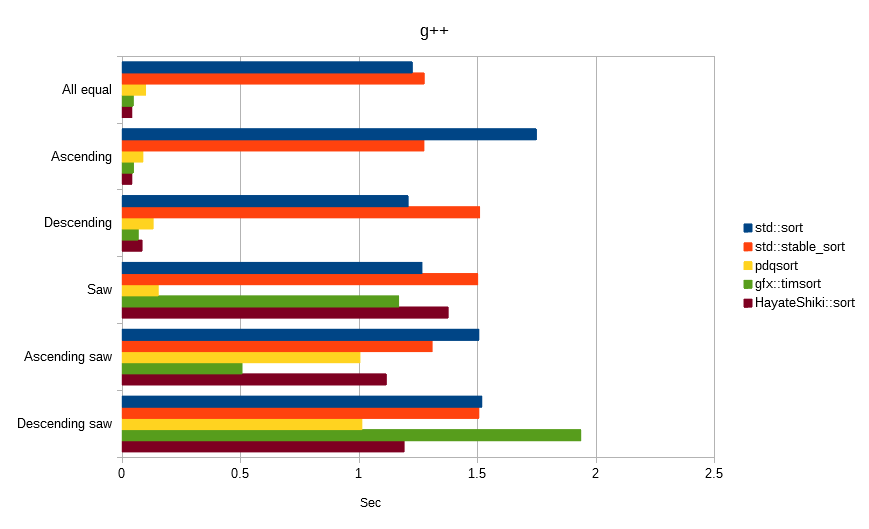

# 颯式
颯式（はやてしき）は、「クイックソート種より高速」を目指した、マージソートの改良アルゴリズムです。  

以下の特徴があります。  
* 比較ソート
* 安定ソート
* 外部領域：N
* 最良時間：O(N)
* 平均時間：O(N log N)
* 最悪時間：O(N log N)
* 再帰：無し

 

# 基本となるアルゴリズム
* 外部領域を、2Nの連続帯として見立てます。
* 値を外部領域に置く際、以下のルールを適用します。
  * （最大値 ≦ 値）であれば、昇順列の上側に置き、最大値を更新します。
  * （値 ＜ 最小値）であれば、降順列の下側に置き、最小値を更新します。
  * （最小値 ≦ 値 ＜ 最大値）であれば、新しい値（最大値であり最小値）を昇順列に置き、それまでに並べた値群をPartとします。
* Part群をマージします。

## 具体的な流れ
~~~
外部領域を、2Nの連続帯として見立てます

4 5 1 2 7 6 3 8|入力列
. . . . . . . .|外部領域
→昇順列  降順列←|実際

               |4 5 1 2 7 6 3 8|入力列
. . . . . . . . . . . . . . . .|外部領域
        降順列←｜→昇順列        |2N見立て
~~~
~~~
新しい値（最大値であり最小値）を昇順列に置く
               |. 5 1 2 7 6 3 8
. . . . . . . . 4 . . . . . . .
~~~
~~~
次の値は（最大値 ≦ 値）なので、昇順列の上側に置き、最大値を更新
               |. . 1 2 7 6 3 8
. . . . . . . . 4 5 . . . . . .
~~~
~~~
次の値は（値 ＜ 最小値）なので、降順列の下側に置き、最小値を更新
               |. . . 2 7 6 3 8
. . . . . . . 1 4 5 . . . . . .
~~~
~~~
次の値は（最小値 ≦ 値 ＜ 最大値）なので、新しい値（最大値であり最小値）を昇順列に置く（Part：145が完成）
               |. . . . 7 6 3 8
. . . . . . .|1 4 5|2 . . . . .
~~~
~~~
次の値は（最大値 ≦ 値）なので、昇順列の上側に置き、最大値を更新
               |. . . . . 6 3 8
. . . . . . .|1 4 5|2 7 . . . .
~~~
~~~
次の値は（最小値 ≦ 値 ＜ 最大値）なので、新しい値（最大値であり最小値）を昇順列に置く（Part：27が完成）
               |. . . . . . 3 8
. . . . . . .|1 4 5|2 7|6 . . .
~~~
~~~
次の値は（値 ＜ 最小値）なので、降順列の下側に置き、最小値を更新
               |. . . . . . . 8
. . . . . . 3|1 4 5|2 7|6 . . .
~~~
~~~
次の値は（最大値 ≦ 値）なので、昇順列の上側に置く（Part：368が完成）
               |. . . . . . . .
. . . . . .|3|1 4 5|2 7|6 8|. .
~~~
~~~
最終的な外部領域
4 5|2 7|6 8|. .  昇順列見立て
. . . . . .|3|1  降順列見立て
4 5|2 7|6 8|3|1  実際の内容
~~~
~~~
生成したPart群をマージします  
145  27  368  
12457  368  
12345678  
ソート完了  
~~~

 

# 改良
基本アルゴリズムから更に、以下の改良を施します。
* Partの長さを確保する為、インサートソートを行います。
* 再帰をしないように、逐次マージを行います。

 

# ビルド＆テスト
検証を行った環境は以下のとおりです。
* Windows 10 Pro 64bit
* Core i7-8700 3.20GHz

## **Msvc**
Microsoft(R) C/C++ Optimizing Compiler Version 19.16.27027.1 for x64  
~~~
cl Main.cpp -std:c++14 -DNDEBUG -Ox -EHsc -Fe:TestMsvc.exe
TestMsvc.exe
~~~

## **clang++**
clang version 8.0.0 (tags/RELEASE_800/final)  
Target: x86_64-w64-windows-gnu  
~~~
clang++ Main.cpp -std=c++14 -DNDEBUG -O3 -o TestClang++.exe
TestClang++.exe
~~~

## **g++**
gcc version 8.3.0 (Rev2, Built by MSYS2 project)  
Target: x86_64-w64-mingw32  
~~~
g++ Main.cpp -std=c++14 -DNDEBUG -O3 -o TestG++.exe
TestG++.exe
~~~

 

# 乱数ベンチマーク
同じシードから生成したfloat値をソートしました。  
単位は秒で、数値が低いほど高速です。  

 

# 特性ベンチマーク
以下は全て、float値「100,000,000」件でソートしました。  
単位は秒で、数値が低いほど高速です。  

 

# 余談
如何だったでしょうか？  

std::stable_sortに全勝しました！  
gfx::timsortには、乱数では勝てましたが、特性では僅差となりました。  
そして、std::sortに常勝するのは容易でないことが分かりました。  
ですが、環境や運用次第では、std::sortに勝る可能性を秘めているかもしれません。  

マージソート種がクイックソート種に勝てる日は来るのでしょうか？  

ソートアルゴリズムには、まだ浪漫が残っています。  

---
以下も併せて読んでいただけると、より楽しめるかも知れません。  
* [刹那式（せつなしき）](https://github.com/EmuraDaisuke/SortingAlgorithm.SetsunaShiki)
* [焔式（ほむらしき）](https://github.com/EmuraDaisuke/SortingAlgorithm.HomuraShiki)
