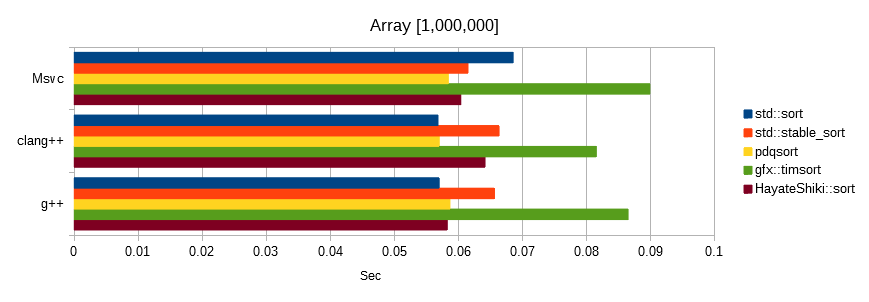
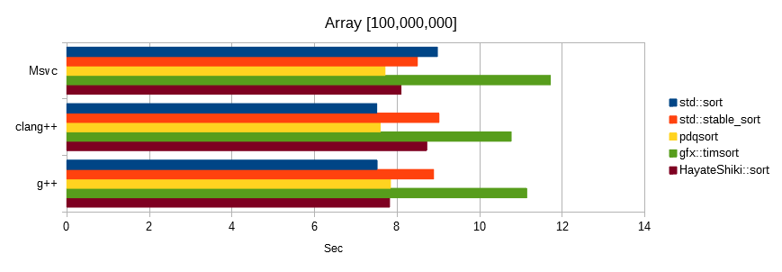
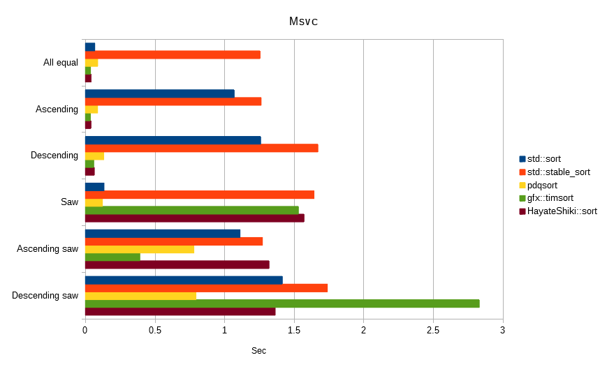

# 颯式(Hayate-Shiki)
Hayate-Shiki is an improved merge sort algorithm with the goal of "faster than quick sort".  

It has the following features.  
* Comparison sort
* Stable sort
* External area: N
* Best time: O (N)
* Average time: O (N log N)
* Worst time: O (N log N)
* Recursion: None

 

# Basic algorithm
* The external area is regarded as a 2N continuous band.
* The following rules apply when placing values ​​in the external area.
  * If (maximum <= value), place it above the ascending order column and update the maximum.
  * If (value < minimum), place it below the descending column and update the minimum.
  * If (minimum <= value < maximum), place new values ​​(maximum and minimum) in ascending order column, and let the value group arranged so far be Part.
* Merge parts.

 

## Examples
~~~
The external area is regarded as a 2N continuous band.

4 5 1 2 7 6 3 8|Input column
. . . . . . . .|External area
->Asc     Dsc<-|Actually

               |4 5 1 2 7 6 3 8|Input column
. . . . . . . . . . . . . . . .|External area
          Dsc<-|->Asc          |2N continuous band
~~~
~~~
Put new values ​​(maximum and minimum) in ascending order column.
               |. 5 1 2 7 6 3 8
. . . . . . . . 4 . . . . . . .
~~~
~~~
The next value is (maximum <= value), place it above the ascending order column and update the maximum.
               |. . 1 2 7 6 3 8
. . . . . . . . 4 5 . . . . . .
~~~
~~~
The next value is (value < minimum), place it below the descending column and update the minimum.
               |. . . 2 7 6 3 8
. . . . . . . 1 4 5 . . . . . .
~~~
~~~
The next value is (minimum <= value < maximum), place new values ​​(maximum and minimum) in ascending order column,
and let the value group arranged so far be Part.(Part: 145 completed)
               |. . . . 7 6 3 8
. . . . . . .|1 4 5|2 . . . . .
~~~
~~~
The next value is (maximum <= value), place it above the ascending order column and update the maximum.
               |. . . . . 6 3 8
. . . . . . .|1 4 5|2 7 . . . .
~~~
~~~
The next value is (minimum <= value < maximum), place new values ​​(maximum and minimum) in ascending order column,
and let the value group arranged so far be Part.(Part: 27 completed)
               |. . . . . . 3 8
. . . . . . .|1 4 5|2 7|6 . . .
~~~
~~~
The next value is (value < minimum), place it below the descending column and update the minimum.
               |. . . . . . . 8
. . . . . . 3|1 4 5|2 7|6 . . .
~~~
~~~
The next value is (maximum <= value), place it above the ascending order column and update the maximum.(Part: 368 completed)
               |. . . . . . . .
. . . . . .|3|1 4 5|2 7|6 8|. .
~~~
~~~
External area result.
4 5|2 7|6 8|. .  Ascending column arrangement
. . . . . .|3|1  Descending column arrangement
4 5|2 7|6 8|3|1  Actual arrangement
~~~
~~~
Merge generated Parts.
145  27  368
12457  368
12345678
Sort complete.
~~~

 

# Improvement
We will make additional improvements to the basic algorithm.  
* Insert sort is performed to secure the length of Part.
* Merge sequentially to avoid recursion.

 

# Build & Test
The following environment has been verified.  
* Windows 10 Pro 64bit
* Core i7-8700 3.20 GHz

 

## **Msvc**
Microsoft(R) C/C++ Optimizing Compiler Version 19.16.27027.1 for x64  
~~~
cl Main.cpp -std:c++14 -Ox -EHsc -Fe:TestMsvc.exe
TestMsvc.exe
~~~

## **clang++**
clang version 8.0.0 (tags/RELEASE_800/final)  
Target: x86_64-w64-windows-gnu  
~~~
clang++ Main.cpp -std=c++14 -O3 -o TestClang++.exe
TestClang++.exe
~~~

## **g++**
gcc version 8.3.0 (Rev2, Built by MSYS2 project)  
Target: x86_64-w64-mingw32  
~~~
g++ Main.cpp -std=c++14 -O3 -o TestG++.exe
TestG++.exe
~~~

 

# Random number benchmark
Sorts float values ​​generated from the same seed.  
The unit is seconds, the lower the number, the faster.  

 

# Limited condition benchmark
The following all sorted the array [100,000,000] of float value.  
The unit is seconds, the lower the number, the faster.  

 

# Finally
How was it?  

Hayate-Shiki is a stable sort, but has strong characteristics to random numbers.  
Does it come the day when merge sort wins quick sort?  

The sort algorithm is still romantic.  

 

---
It may be more enjoyable if you read the following together.  
* [Setsuna-Shiki](https://github.com/EmuraDaisuke/SortingAlgorithm.SetsunaShiki)
* [Homura-Shiki](https://github.com/EmuraDaisuke/SortingAlgorithm.HomuraShiki)
